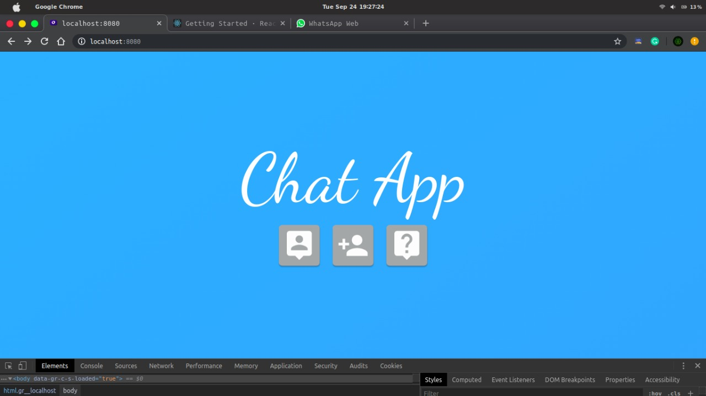

# python-Flask-Chat-App

#### simple localhost chat app

# To run the program

You need to have the python Flask in your pc. To install visit 
 #### https://flask.palletsprojects.com/en/1.1.x/tutorial/
 
 after installing flask run the program by running the command in your Shell or command prompt.
 
          python ./ObSe.py
